# Into the Woods

This is the documentation for Into the Woods - interactive javascript game. The site has been built using HTML5, CSS3 and Javascript for the Milestone 2 project for Code Institute's web development diploma.

******

## Contents

* [User Experience (UX)](#user-experience---ux)
  * [Strategy](#strategy)
    * [User Stories](#user-stories)
  * [Scope](#scope)
  * [Structure](#structure)
  * [Skeleton](#skeleton)
* [User Interface (UI) Design](#user-interface---design)
  * [Typography](#typography) 

[*Back to top*](#contents)

-----

## User Experience - UX

### Strategy

This project was inspired by my interest in RPG style gaming and storytelling. The goal is to create an interactive and user-friendly choose your own adventure demo.

#### User Goals

- Play a simple adventure game that is fun and engaging.
- Be able to collect multiple endings by replaying the game. 

#### Site Owner Goals

- Create a game that is fun and engaging.
- Design the game to be visually appealing.
- Provide a responsive and accessible website.
- Create seamless interactivity that can't be accidentally broken by the user.

#### User Stories

- I want to be able to easily navigate through the game.
- I want to be able to see the different endings I have discovered.
- I want to be able to see which items I have in my inventory.

[*Back to top*](#contents)

-----

### Scope

Taking all of the above into account I decided that there needed to be only one page for the game. This would allow the user to focus on the game and not be distracted by other pages.

* __Game Page:__ This will contain the whole game and will be the only page on the site. The game will be contained within a single container using text nodes to navigate the different parts of the story. The game will have three links above the game container that will allow the user to navigate to the inventory, endings and music. 

As well as the main page there will be a custom 404 page that redirects users to the main page if the link is typed incorrectly.

[*Back to top*](#contents)

-----

### Structure

As the site has only one page there will be no navigation route. The links at the top of the page will be used to navigate to the different sections of the game using modals.

[*Back to top*](#contents)

-----

### Skeleton

#### Wireframes

All wireframes have been created with [Figma](https://figma.com/).

Into the Woods Desktop Wireframe

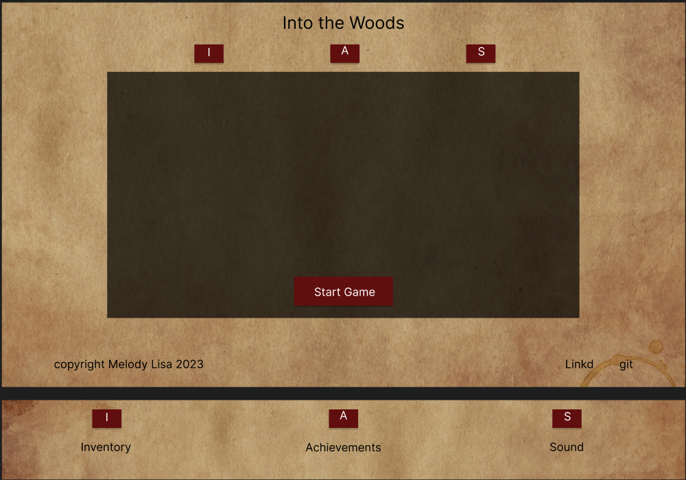

Into the Woods Tablet Wireframe

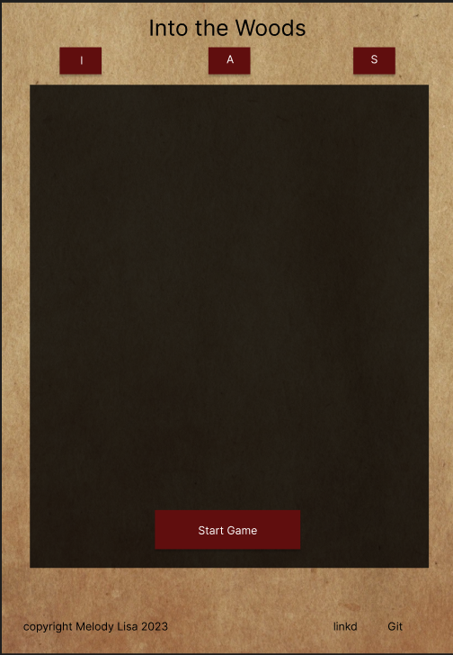

Into the Woods Mobile Wireframe

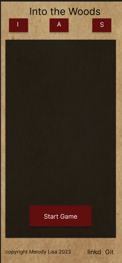

Into the Woods Modals Wireframe

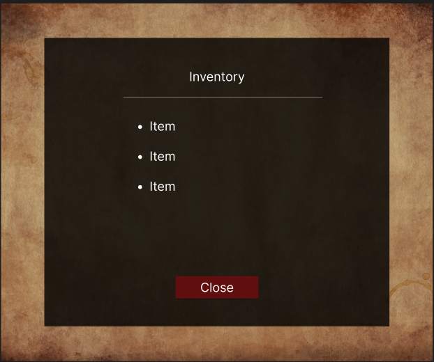

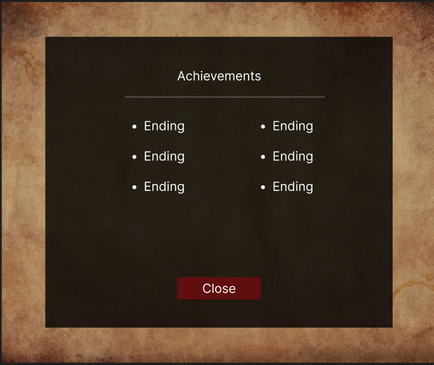

-------

The wireframes featured here are the final versions of the wireframes. The original wireframes were created with the idea of having multiple game containers for the inventory and achievements sections. After some consideration I decided to use only one container and implement modals for the smaller sections. This would allow for more seamless styling for the game container.

[*Back to top*](#contents)

-----

## User Interface - Design

### Surface

#### Typography

Fonts have been imported from [Google Fonts](https://fonts.google.com/).

* The [Pixelify Sans](https://fonts.google.com/specimen/Pixelify+Sans?query=Pixelify+Sans) font has been used for the main title along with the main text used for the game. "Cursive" is the fallback font in case the browser doesn't import the font correctly. I chose this style of font as I believe it fits with the theme of the product. Letter spacing has been added to the game text for better readability. 

* The [Zen Loop](https://fonts.google.com/specimen/Zen+Loop?query=zen+loop) font has been used for the buttons. Sans-serif is the fallback font in case the browser doesn't import the font correctly. I chose this as it is a sleek font that doesn't make the buttons look too busy or bulky when there is more text within the options.

#### Colours

The colour scheme for the site was kept as simple as possible to avoid too much going on with the inclusion of the brown parchment background image. The main game container is black with reduced opacity. Text within the game container, modals and buttons is a silver/grey and text outside of the containers is black. The buttons and nav item hover effects across the game are red to contrast with the rest of the page to make them stand out. The linkedin and github icons have hover effects that change the colour of the icons to match the colours of their respective logos.

Main colour scheme for the site

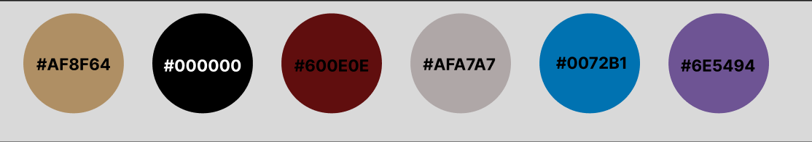

--------

Colour scheme images made with [figma](https://figma.com).

[*Back to top*](#contents)

-------

## Features

### Header

Header

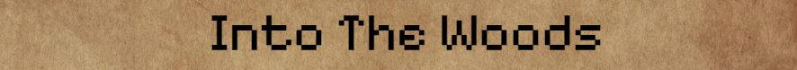

The header "Into the Woods" appears at the top of the page in all screen sizes.

Navbar

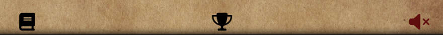

The navbar contains three icons that can be clicked to view the inventory, view achievements, and toggle music. The inventory and achievements icons open modals that contain the inventory and achievements text nodes. The music icon toggles the music on and off.

### Main

Game Container

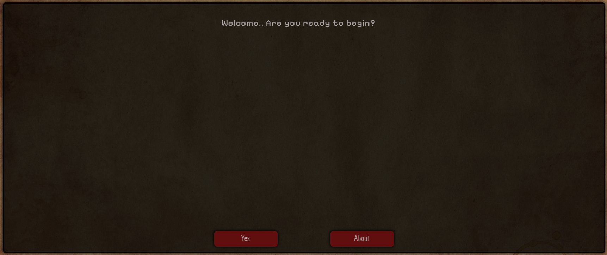

About Section

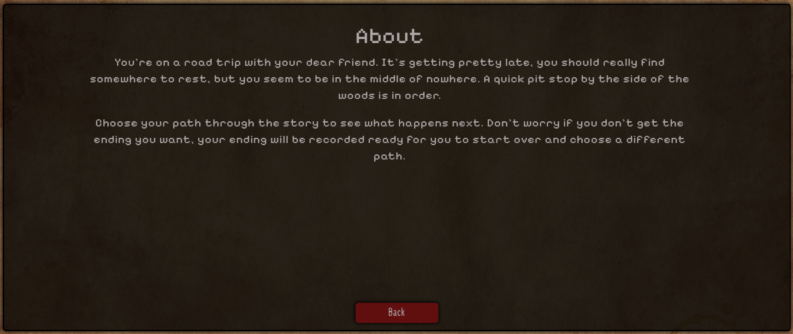

Game

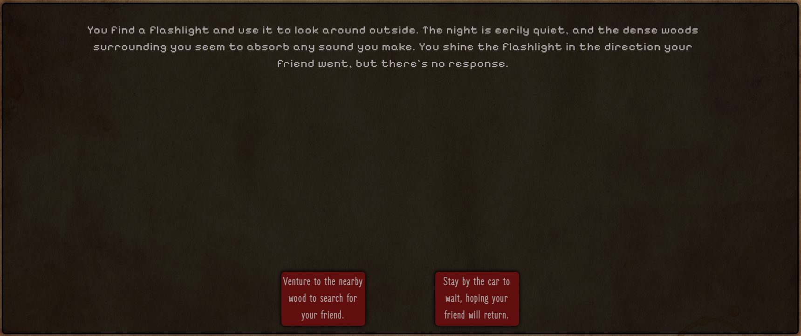

Item Specific Options

Endings

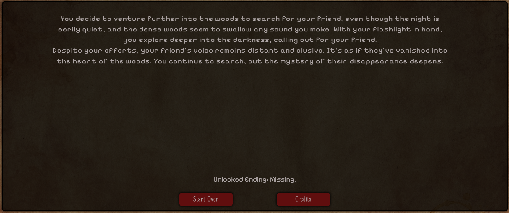

Credits

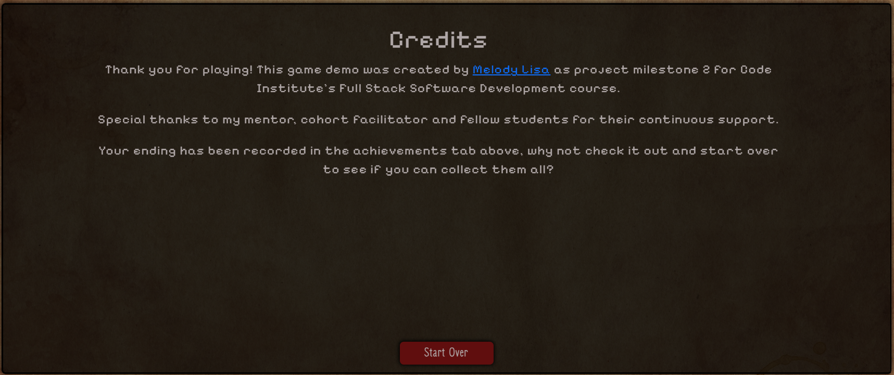

The game container appears in the center of the page and is where the game is played. The game container contains the about section, game, endings and credits text nodes. 

* The start game and about section are the first text nodes that the user can click when the page loads. 

* The game text nodes are where the user will make their choices and potentially collect items that will be shown within the inventory modal during gameplay. 

* An endings text node is opened when the game is completed which will be logged within the achievements modal and the credits text node can be opened from any ending.

### Modals

Inventory Modal

The inventory modal can be opened at any time during gameplay and does not affect the game. The inventory modal contains the items that the user has collected during a playthrough. This will be cleared every time the user begins a new game as there is a section of the game that shows different options based on the inventory items the player has.

Achievements Modal

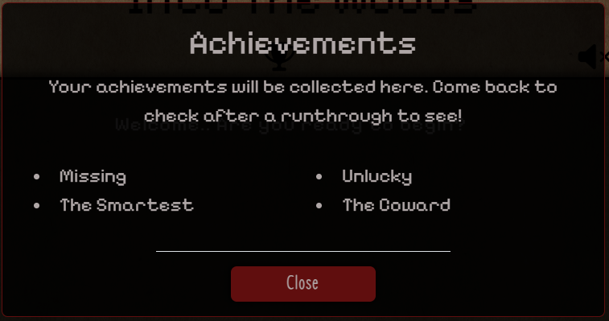

The achievements modal can be opened at any time during gameplay and does not affect the game. The achievements modal contains the endings that the user has collected over multiple playthroughs. This is not cleared every time the user begins a new game so that the user can see which endings they have collected.

### Footer

Footer

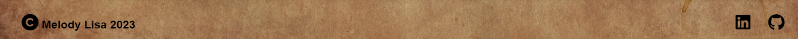

The footer contains the copyright information and social media links. The social media links open in a new tab.

[*Back to top*](#contents)

------

## Future Implementations

1. The game text originally featured a typewriter effect that was removed due to the requirement of html within the text nodes. I would like to implement this in future versions of the site on certain text nodes or with refactoring of text nodes.

2. There was a plan early on in development to implement dynamic background images that would change depending on the text node that was being displayed. This was not achievable within the timeframe of the project, but is an option to look into in future versions of the site.

3. Due to the nature of the project I was unable to implement a save feature for the game. This is an option to look into in future versions of the site.

4. Due to the time constraints of the project the game itself is designed as a demo. I would like to implement a full game in future versions of the site.

[*Back to top*](#contents)

-----