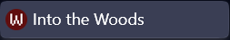

# Into the Woods

By Melody Lisa.

[View the live project here.](https://melody-lisa.github.io/into-the-woods/)

This is the documentation for Into the Woods - interactive javascript game. The site has been built using HTML5, CSS3 and Javascript for the Milestone 2 project for Code Institute's web development diploma.

******

## Contents

* [User Experience (UX)](#user-experience---ux)
  * [Strategy](#strategy)
    * [User Goals](#user-goals)
    * [Site Owner Goals](#site-owner-goals)
    * [User Stories](#user-stories)
  * [Scope](#scope)
  * [Structure](#structure)
  * [Skeleton](#skeleton)
* [User Interface (UI) Design](#user-interface---design)
  * [Typography](#typography)
  * [Colours](#colours)
* [Features](#features)
    * [Header](#header)
    * [Main](#main)
    * [Modals](#modals)
    * [Footer](#footer)
    * [404 Page](#404-page)
* [Future Implementations](#future-implementations)
* [Accessibility](#accessibility)
  * [Alt Text](#alt-text)
  * [Aria Labels](#aria-labels)
  * [Colours](#colours-1)
  * [Fonts](#fonts)
* [Technologies Used](#technologies-used)
  * [Languages](#languages)
  * [Frameworks, Libraries, and Programs Used](#frameworks-libraries-and-programs-used)
* [Deployment & Local Development](#deployment--local-development)
  * [Deployment](#deployment)
  * [Local Development](#local-development)
    * [How to Fork](#how-to-fork)
    * [How to Clone](#how-to-clone)
* [Testing](#testing)
* [Credits](#credits)
  * [Code Used](#code-used)
  * [Content](#content)
  * [Media](#media)
  * [Achnowledgements](#acknowledgements)
 

[*Back to top*](#contents)

-----

## User Experience - UX

### Strategy

This project was built as a milestone project on my Diploma in Web Application Development with [Code Institute](https://codeinstitute.net/) as a learning tool for interactive frontend development and my first project using JavaScript and so there was no specific client. However, in order to create a more professional product I treated it as a real-world application inspired by my own interest in RPG style gaming and storytelling. The goal was to create an interactive and user-friendly choose your own adventure demo for anyone who enjoys a good story and a bit of spooky fun.

#### User Goals

- Play a simple adventure game that is fun and engaging.
- Be able to collect multiple endings by replaying the game. 

#### Site Owner Goals

- Create a game that is fun and engaging.
- Design the game to be visually appealing.
- Provide a responsive and accessible website.
- Create seamless interactivity that can't be accidentally broken by the user.

#### User Stories

- I want to be able to easily navigate through the game.
- I want to be able to see the different endings I have discovered.
- I want to be able to see which items I have in my inventory.

[*Back to top*](#contents)

-----

### Scope

Taking all of the above into account I decided that there needed to be only one page for the game. This would allow the user to focus on the game and not be distracted by other pages.

* __Game Page:__ This will contain the whole game and will be the only page on the site. The game will be contained within a single container using text nodes to navigate the different parts of the story. The game will have three links above the game container that will allow the user to navigate to the inventory, endings and music. 

As well as the main page there will be a custom 404 page that redirects users to the main page if the link is typed incorrectly.

[*Back to top*](#contents)

-----

### Structure

As the site has only one page there will be no navigation route. The links at the top of the page will be used to navigate to the different sections of the game using modals.

[*Back to top*](#contents)

-----

### Skeleton

#### Wireframes

All wireframes have been created with [Figma](https://figma.com/).

Into the Woods Desktop Wireframe

Into the Woods Tablet Wireframe

Into the Woods Mobile Wireframe

Into the Woods Modals Wireframe

-------

The wireframes featured here are the final versions of the wireframes. The original wireframes were created with the idea of having multiple game containers for the inventory and achievements sections. After some consideration I decided to use only one container and implement modals for the smaller sections. This would allow for more seamless styling for the game container.

[*Back to top*](#contents)

-----

## User Interface - Design

### Surface

#### Typography

Fonts have been imported from [Google Fonts](https://fonts.google.com/).

* The [Pixelify Sans](https://fonts.google.com/specimen/Pixelify+Sans?query=Pixelify+Sans) font has been used for the main title along with the main text used for the game. "Cursive" is the fallback font in case the browser doesn't import the font correctly. I chose this style of font as I believe it fits with the theme of the product. Letter spacing has been added to the game text for better readability. 

* The [Zen Loop](https://fonts.google.com/specimen/Zen+Loop?query=zen+loop) font has been used for the buttons. Sans-serif is the fallback font in case the browser doesn't import the font correctly. I chose this as it is a sleek font that doesn't make the buttons look too busy or bulky when there is more text within the options.

#### Colours

The colour scheme for the site was kept as simple as possible to avoid too much going on with the inclusion of the brown parchment background image. The main game container is black with reduced opacity. Text within the game container, modals and buttons is a silver/grey and text outside of the containers is black. The buttons and nav item hover effects across the game are red to contrast with the rest of the page to make them stand out. The linkedin and github icons have hover effects that change the colour of the icons to match the colours of their respective logos.

Main colour scheme for the site

Colour scheme images made with [figma](https://figma.com).

[*Back to top*](#contents)

-------

## Features

### Favicon

Favicon

The favicon for the site is a red circle with a white W. This is a simple design that is easy to recognise and matches the colour scheme of the site. The favicon was created using [favicon.io](https://favicon.io/).

### Header

Header

The header "Into the Woods" appears at the top of the page in all screen sizes.

Navbar

The navbar contains three icons that can be clicked to view the inventory, view achievements, and toggle music. The inventory and achievements icons open modals that contain the inventory and achievements text nodes. The music icon toggles the music on and off.

### Main

Game Container

About Section

Game

Item Specific Options

Endings

Credits

The game container appears in the center of the page and is where the game is played. The game container contains the about section, game, endings and credits text nodes. 

* The start game and about section are the first text nodes that the user can click when the page loads. 

* The game text nodes are where the user will make their choices and potentially collect items that will be shown within the inventory modal during gameplay. 

* An endings text node is opened when the game is completed which will be logged within the achievements modal and the credits text node can be opened from any ending.

### Modals

Inventory Modal

The inventory modal can be opened at any time during gameplay and does not affect the game. The inventory modal contains the items that the user has collected during a playthrough. This will be cleared every time the user begins a new game as there is a section of the game that shows different options based on the inventory items the player has.

Achievements Modal

The achievements modal can be opened at any time during gameplay and does not affect the game. The achievements modal contains the endings that the user has collected over multiple playthroughs. This is not cleared every time the user begins a new game so that the user can see which endings they have collected.

### Footer

Footer

The footer contains the copyright information and social media links. The social media links open in a new tab.

### 404 Page

404 Page

The 404 page is a custom page that redirects the user to the main page if they type in an incorrect url.

[*Back to top*](#contents)

------

## Future Implementations

1. The game text originally featured a typewriter effect that was removed due to the requirement of html within the text nodes. I would like to implement this in future versions of the site on certain text nodes or with refactoring of text nodes.

2. There was a plan early on in development to implement dynamic background images that would change depending on the text node that was being displayed. This was not achievable within the timeframe of the project, but is an option to look into in future versions of the site.

3. Due to the nature of the project I was unable to implement a save feature for the game. This is an option to look into in future versions of the site.

4. Due to the time constraints of the project the game itself is designed as a demo. I would like to implement a full game in future versions of the site.

5. I would like to implement a feature that shows more information about the achievements that the user has collected in future versions of the site. This could be done by adding a tooltip with some information about the ending when the user hovers over the achievment within the modal.

6. At this stage of development the 404 page loads only when the user types in an incorrect url to the main page. I would like to implement a 404 page that loads if the user clicks on any broken link within the site, including the modals.

7. After testing with accessibility tools I found that every new text node that is loaded, the screen reader will read the entire page again. I would like to implement a feature that will only read the new text node when it is loaded in future versions of the site.

[*Back to top*](#contents)

-----

## Accessibility

### Alt Text

Alternative text has been included for all images across the site.

### Aria Labels

Aria labels have been included for all links across the site with modals labelled by their headings.

### Colours

The colours across the site have been kept simple with black text over the light parchment background and light grey text over the black game container. The buttons have a red background with light grey text to contrast with the rest of the page. The light grey text has been chosen over pure white to reduce harshness on the eyes while also maintaining a high contrast ratio.

### Fonts

The fonts used across the game have had letter spacing added to improve readability.

[*Back to top*](#contents)

-------

## Technologies Used

### Languages

- HTML
- CSS
- Javascript

### Frameworks, Libraries, and Programs Used

* [Bootstrap V5.3](https://getbootstrap.com/) - The framework for the website. Additional CSS styling was also implemented in style.css.

* [favicon](https://favicon.io/) - To create the favicon for the site.

* [Figma](https://figma.com/) - For wireframes and other graphics in readme.

* [Font Awesome](https://fontawesome.com/) - For the iconography on the website.

* Git - For version control.

* [Github](https://github.com/) - To save and store the files for the website.

* Google Dev Tools - To troubleshoot and test features, solve issues with responsiveness and styling.

* [JS Hint](https://jshint.com/) - To check the javascript code for errors.

* [Google Fonts](https://fonts.google.com/) - To import the fonts used on the website.

* [Pexels](https://pexels.com/) - For background image and music.

* [Pixabay](https://pixabay.com/) - For music.

* [Red Ketchup](https://redketchup.io/image-resizer) - To convert background image to webp format.

* Samsung Talkback - To test accessibility.

* [UI.dev](https://ui.dev/amiresponsive) - To show the site on a range of screen sizes.

* [W3C Markup Validation Service](https://validator.w3.org/) - To validate HTML and CSS code.

[*Back to top*](#contents)

-------

## Deployment & Local Development

### Deployment

Github Pages was used to deploy the live website. The instructions to achieve this are below:

1. Log in (or sign up) to [Github](https://github.com/).
2. Find the repository for this project, [into-the-woods](https://github.com/Melody-Lisa/into-the-woods/).
3. Click on the Settings link.
4. Click on the Pages link in the left hand side navigation bar.
5. In the Source section, choose main from the drop down select branch menu. Select Root from the drop down select folder menu.
6. Click Save. Your live Github Pages site is now deployed at the URL shown.

### Local Development

* #### How to Fork

To fork the into-the-woods repository:

1. Log in (or sign up) to [Github](https://github.com/).
2. Go to the repository for [this project](https://github.com/Melody-Lisa/into-the-woods/).
3. Click the Fork button in the top right corner.

* #### How to Clone

To clone the into-the-woods repository:

1. Log in (or sign up) to [Github](https://github.com/).
2. Go to the repository for [this project](https://github.com/Melody-Lisa/into-the-woods/).
3. Click on the code button, select whether you would like to clone with HTTPS, SSH or GitHub CLI and copy the link shown.
4. Open the terminal in your code editor and change the current working directory to the location you want to use for the cloned directory.
5. Type 'git clone' into the terminal and then paste the link you copied in step 3. Press enter.

[*Back to top*](#contents)

-----

## Testing

Please see [testing.md](testing.md) for all testing elements of this site.

[*Back to top*](#contents)

-----

## Credits

### Code Used

* [Bootstrap](https://getbootstrap.com/docs/5.3/components/modal/): Code from this page was used and adapted to create the modals.

* [Math With Crab](https://github.com/zhannamatuzak/math-with-crab/tree/main): Code from this project was used and adapted to create the music functionality.

* [Web Dev Simplified](https://www.youtube.com/watch?v=R1S_NhKkvGA): Youtube: This walkthrough was used and adapted to create the game functionality.

### Content

* [ChatGPT](https://chat.openai.com/): Used to generate content for the game.
* [Melody Lisa](https://github.com/Melody-Lisa): All other content created by the developer.

### Media

* [Pexels](https://www.pexels.com/photo/empty-brown-canvas-235985/): Used to source the background image for the site.

* [PixaBay](https://pixabay.com/music/beats-mysterious-forest-creepy-lofi-halloween-lofi-halloween-music-168238/): Used to source the music for the site.

* [UI.dev](https://ui.dev/amiresponsive): Used to generate images that showcase the responsive design within the readme file.

### Acknowledgements

* Jubril Akolade - Mentor: For the encouragement and providing great insights into building my project.

* [Iris Smok](https://github.com/Iris-Smok) - Cohort Facilitator: For hosting informative standup's and providing a great class atmosphere.

* Irene Neville - Cohort Facilitator: For taking over the cohort during the final stages of the project and providing great insights into building my project.
 
* Class June 2023: Everyone in my class channel on slack who is involved with the stand ups and group chat for contributing to the great atmosphere and supportive environment.
 
* The wider slack community: For quick responses to various issues and questions I had at all stages of the project.
 
* Friends and Family: For helping me to test my site on various devices and provide feedback.

[*Back to top*](#contents)
