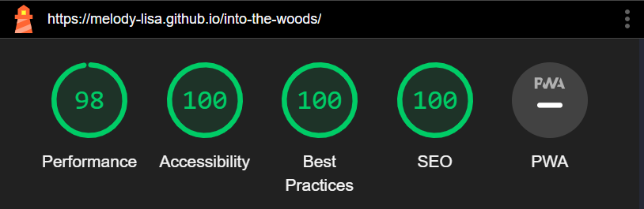

# Into the Woods - Testing

-----

## Contents

* [Automated Testing](#automated-testing)
    * [W3C Validator](#w3c-validator)
    * [Lighthouse](#lighthouse)
    * [JSHint](#jshint)
* [Manual Testing](#manual-testing)
    * [Testing User Stories](#testing-user-stories)
    * [Full Testing](#full-testing)
* [Bugs](#bugs)
    * [Solved Bugs](#solved-bugs)
    * [Known Bugs](#known-bugs)

-----

## Automated Testing

This automated testing section contains all testing that has been run through a program to produce validation and performance insights.

### W3C Validator

[W3C](https://validator.w3.org/#validate_by_input) was used to validate all HTML and CSS for the site via direct input. Each individual page was tested and final reconfiguration was carried out to ensure all results produced no errors.

Game Page

404 Page

CSS Stylesheets

All HTML and CSS tested through the validator returned no errors or warnings.

### Lighthouse

The lighthouse tool within the chrome developer tools has been used to test performance, best practices, accessibility, and SEO. Desktop and mobile tests have been run for each page.

Game Page

| | Performance | Accessibility | Best Practice | SEO |
| :---: | :---: | :---: | :---: | :---: |
| Desktop | 98 | 100 | 100 | 100 |
| Mobile | 94 | 100 | 100 | 100 |

### JSHint

[JSHint](https://jshint.com/) was used to test all JavaScript files.

Game Page

All JavaScript files tested through JSHint returned no errors or warnings when the 'ES6' option was selected and all files were tested together.

[*Back to top*](#contents)

------

## Manual Testing

### Testing User Goals

> * Play a simple adventure game that is fun and engaging.

The game is designed to be simple to play with a single click of the mouse or tap of the screen. The game is also designed to be played on mobile devices with a single tap of the screen. The game is designed to be fun and engaging with multiple endings and a variety of choices to make with the option to add ambient sound effects to enhance the experience.

> * Be able to collect multiple endings by replaying the game.

At this time the game is designed only as a demo, however, it has been created with replayability in mind with multiple short paths to explore and multiple endings to discover. These endings are tracked in the achievements modal and can be viewed at any time while the user is on the site.

### Testing Site Owner Goals

> * Create a game that is fun and engaging.

Inventory Features

The game is designed to be fun and engaging with ten different endings and a variety of choices to make with the game to add ambient music and small implementation of inventory functionality to enhance the experience with users needing certain items for specific sections of the game, starting with the flashlight in order to look around outside.

> * Design the game to be visually appealing.

Responsive Design

The game is designed to be visually appealing with a simple design and responsive layout that is easy to navigate and play on all devices.

> * Provide a responsive and accessible website.

The game is designed to be responsive and accessible with a simple design and responsive layout that is easy to navigate and play on all devices. The game has been tested on mobile devices using accessibility tools including talkback feature for screen readers.

> * Create seamless interactivity that can't be accidentally broken by the user.

404

Javascript funtions have been implemented within the game container so that only options that take the user to the next part of the game are clickable. The navigation bar is always visible at the top of the page to access any extra features. The 404 page is designed to navigate the user back to the game page if an incorrect url is entered.

### Testing User Stories

> * I want to be able to easily navigate through the game.

Simple navigation

The game is designed to be simple to navigate. The navigation bar is always visible at the top of the page to access any extra features and the game is designed to be played with a single click of the mouse. The game is also designed to be played on mobile devices with a single tap of the screen. The about section is available at the start of the game with credits available at the end of the game.

> * I want to be able to see the different endings I have discovered.

Achievements

The achievements modal is designed to show the user which endings they have discovered. The achievements modal is also designed to be simple to navigate with a single click of the mouse or tap of the screen and is always available in the navigation bar.

> * I want to be able to see which items I have in my inventory.

Inventory

The inventory modal is designed to show the user which items they have in their inventory. The inventory modal is also designed to be simple to navigate with a single click of the mouse or tap of the screen and is always available in the navigation bar.

### Full Testing

Full testing was performed on the following devices:

* Laptop
  * Lenovo IDEAPAD Flex 5i

* Mobile
  * Samsung Galaxy S20 FE 5G
 
 Desktop device tested the site using the following browsers:
 
 * Google Chrome
 * Mozilla Firefox
 * Opera
 * Microsoft Edge

Additional testing has been carried out by friends and colleagues including on apple devices and safari with no bugs reported back.

#### Manual Features Tests

| Feature | Expected Outcome | Testing Performed | Result | Pass/Fail |
| --- | --- | --- | --- | --- |
| The inventory icon | Link opens a modal to show inventory | Clicked icon | Inventory modal opens and shows items based on where you are in the game | __Pass__ |
| The inventory modal close button | Closes the modal | Clicked button | Inventory modal closes | __Pass__ |
| The achievements icon | Link opens a modal to show achievements | Clicked icon | Achievements modal opens and shows achievements based on which endings you have collected. Achievements remain for each new playthrough | __Pass__ |
| The achievements modal close button | Closes the modal | Clicked button | Achievements modal closes | __Pass__ |
| The music icon | Toggles music on and off. Icon changes to show when music is playing or paused | Clicked link | Icon changes and music plays and pauses | __Pass__ |
| Nav icons hover effect | Link changes colour to red | Hover mouse over link | Colour changes to red | __Pass__ |
| The about button | Opens the about text node with button to return to game | Clicked link | Text node and button appear | __Pass__ |
| Game text nodes | Clicking options buttons takes you to the next text node in the game | Clicked buttons | All buttons take you to correct text nodes in the game | __Pass__ |
| Inventory Updates | List item appears in the inventory modal when the story tells you that you have an item | Play through game and checked modal at different intervals | Items appear in the modal during a playthrough and are reset at the start of each game | __Pass__ |
| Achievements Updates | Endings appear in the achievements modal when you reach specific endings | Play through game and checked modal at the end of each playthrough | Achievements appear in the modal and are not duplicated if you reach the same ending twice | __Pass__ |
| The credits button | Opens the credits text node with button to return to game | Clicked link | Text node and button appear | __Pass__ |
| Link in credits | Link opens to my github in a new tab | Clicked link | Link opens in a new tab | __Pass__ |
| LinkedIn icon in footer | Link opens to my LinkedIn in a new tab | Clicked icon | Link opens in a new tab | __Pass__ |
| LinkedIn hover effect | Icon changes colour to blue | Hover mouse over icon | Colour changes to blue | __Pass__ |
| GitHub icon in footer | Link opens to my GitHub in a new tab | Clicked icon | Link opens in a new tab | __Pass__ |
| GitHub hover effect | Icon changes colour to purple | Hover mouse over icon | Colour changes to purple | __Pass__ |
| 404 page | 404 page appears when incorrect url is entered | Entered incorrect url | 404 page appears | __Pass__ |
| Aria labels on links | Provides descriptions of links across the site | Browsed site on desktop and mobile with screen readers active | Screen readers read descriptions of links | __Pass__ |

[*Back to top*](#contents)

------

## Bugs

### Solved Bugs

| # | Issue | Details | What was done | Fixed? |
| --- | --- | --- | --- | --- |
| 1 | Filepath issues between vscode and github deployment | Filepaths for styles and scripts were not working when deployed to github pages | Filepaths were updated to work with github deployment | __Yes__ |
| 2 | Inventory | Inventory items were not being removed when the game was reset | Added a function to remove all items from the inventory when the game is reset | __Yes__ |
| 3 | Duplucated endings | When the same ending was reached it would appear multiple times in the achievements modal | Add an if statement to check whether the ending has already been collected | __Yes__ |
| 4 | Dynamic background | Inclusion of dynamic backgrounds to the game container not working as expected | Feature was removed to allow for more time to work on other features and has been added to the future implementations section | __Removed__ |
| 5 | Typewriter effect | Typewriter effect for the game text nodes not working due to inclusion of HTML within the text nodes | Typewriter effect was removed to allow for more time to work on other features and has been added to the future implementations section | __Removed__ |

### Known Bugs

There are currently no known bugs in this version of the site.

[*Back to top*](#contents)

-----